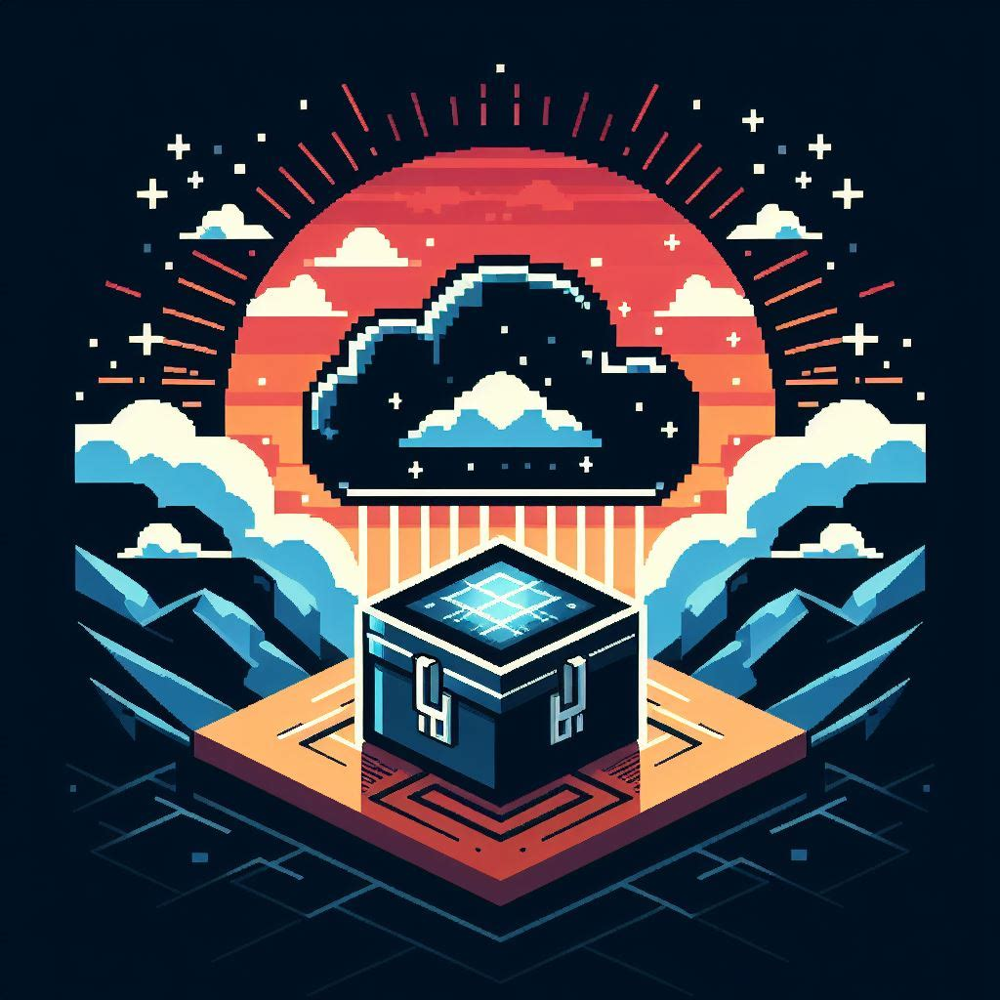

  

# Homelab

## Prerequisites

- [Helm Diff Plugin](https://github.com/databus23/helm-diff)
- [Helmfile](https://github.com/helmfile/helmfile)
- [OpenLens]()
  - [OpenLens Node Pod Menu](https://github.com/alebcay/openlens-node-pod-menu)

Note: Lens closed their source code so probably no more OpenLens updates :(

## Considerations

- Special thanks to Clay for all his help
