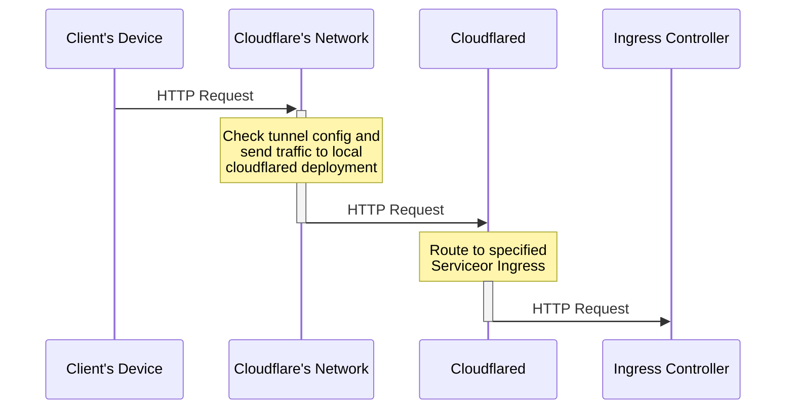

# Cloudflare Tunnel (UNUSED)

Cloudfare's Zero Trust tunnel

Follow this article to understand what to do: [Use cloudflared to expose a Kubernetes app to the Internet](https://developers.cloudflare.com/cloudflare-one/tutorials/many-cfd-one-tunnel/)

## How it Works



## Setup

### Initial Configuration

```shell
$ cloudflared tunnel login

A browser window should have opened at the following URL:

https://dash.cloudflare.com/argotunnel?aud=&callback=https%3A%2F%2Flogin.cloudflareaccess.org%something%3D

If the browser failed to open, please visit the URL above directly in your browser.
You have successfully logged in.
If you wish to copy your credentials to a server, they have been saved to:
/root/.cloudflared/cert.pem

$ cloudflared tunnel create k8s-tunnel
Tunnel credentials written to /root/.cloudflared/something.json. cloudflared chose this file based on where your origin certificate was found. Keep this file secret. To revoke these credentials, delete the tunnel.

Created tunnel k8s-tunnel with id something
```

Update `helmfile.yaml` with the newly created information in `/root/cloudflared/something.json` then run `helmfile apply`. Be careful not to commit this or setup git-crypt.

- Note: I need to figure out how to load this via config map....

### Adding Routes

To add have the tunnel route a new cname, do the following:

```sh
$ cloudflared tunnel route dns k8s-tunnel subdomain.host.whatever
2023-04-20T16:20:52Z INF Added CNAME subdomain.host.whatever which will route to this tunnel tunnelID=<some tunnel id>
```

## Questions

- How to get cloudflared traffic to talk to services behind ingress with TLS?
  - Currently works without TLS enabled for ingresses
